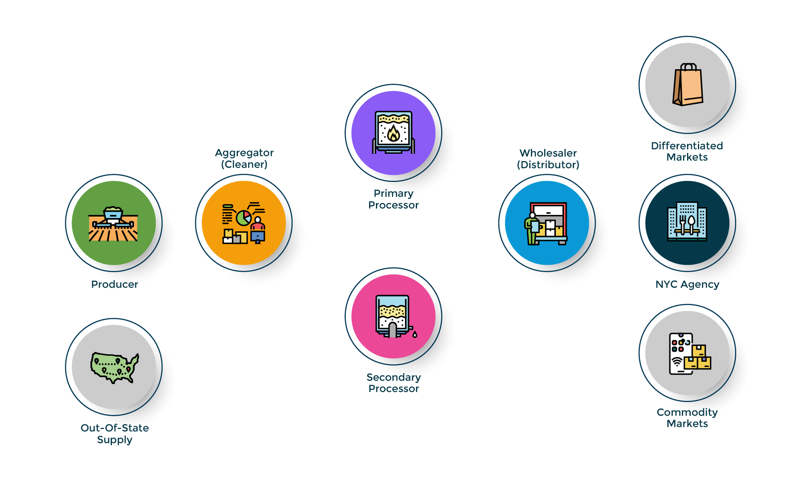

# Model boundaries

## Dry beans supply chain

In the model, each "agent" represents a type of food system participant—such as farms, food businesses, or City agencies—with distinct roles, constraints, decision rules, and characteristics. We refer to these as supply chain stakeholders, each of which has different types of characteristics. For example, a farm can have one or more of the following characteristics: small, certified organic, M/WBE operators.

## Supply Chain Stakeholder Types

**Producer**   Farms that grow beans using land, labor, and other farm inputs. This includes all on-farm production activities—from planting through harvest—but does not include activities such as cleaning or packaging.

**Aggregator (Cleaner)**   These businesses clean and sort dry beans. They may be owned by a single farm, a group of farms, or operate independently. They typically purchase beans in bulk (e.g., by the truckload) and resell them in smaller quantities or in containers for export markets. They operate either by purchasing beans and selling them after cleaning, or by providing cleaning and storage services for a fee.

**Primary Processor**   These businesses use cleaned beans as an input, such as canning operations, bean flour producers, and facilities that package beans into retail-sized bags.

**Secondary Processor**   This is a secondary stage of processing beans into products. These businesses use beans from primary processors as inputs into their products. These include using cooked beans or bean flour to create a new product.

**Wholesaler (Distributor)**   Businesses that sell a product made by someone else. They can sell items from various stages in the supply chain.

**NYC Agency**   A New York City agency that purchases processed bean products from various suppliers.

**Commodity and Differentiated Markets**   Commodity markets (domestic or export) have effectively unlimited supply and demand and typically purchase at the lowest available price. They do not pay premiums for value characteristics (such as organic certification). Differentiated markets have more limited demand but often pay higher prices than commodity markets, reflecting preferences for specific product or business characteristics.  

**Out-of-State-Supply Bean Pathway**   **Contract Information Pathway**

## Causal loop diagram

### Goal and Scope Definition

The goal of the life cycle assessment is to estimate the cradle to NYC-gate environmental impacts of 1 kg of dry bean procured by New York City under several proposed food procurement policies.

Specific goals are:

- Perform an ISO 14040 compliant LCA of the impacts of 6 policy actions on the environmental footprints of dry beans purchased by New York City
- Identify hotspots where environmental mitigation efforts might be targeted for environmental impact reduction

#### Scope

The scope of the analysis includes all stages of the New York state dry bean supply chain. Production, aggregation, cleaning, handling by a primary processor who bags and/or cans the beans, secondary handling by a processor who convert pre-processed beans (i.e., canned or cooked) into products such as bean burgers. Transportation and storage by wholesalers is also represented. To facilitate comparison of the local policy actions, national or global averages for commodity dry beans and soybeans were also modeled.

#### Functional Unit

The functional unit is 1 kg of dry beans.

#### Product System

The product system includes all activities involved in the production and procurement of cleaned, canned, and dry bean products (i.e., bean burgers, bean empanadas, etc.) by New York City agencies. These include cultivation, cleaning, processing, transporting, and packaging.

Product systems included variations of management practices and were as follows:

- Conventional, dry beans, conventional tillage
- Conventional, dry beans, reduced till with cover
- Conventional, dry beans, no till
- Conventional, dry beans, conventional tillage with cover
- Conventional, dry beans, reduced till
- Conventional, dry beans, no till with cover
- Organic, dry beans, conventional tillage
- Organic, dry beans, reduced till with cover
- Organic, dry beans, no till
- Organic, dry beans, conventional tillage with cover
- Organic, dry beans, reduced till
- Organic, dry beans, till with cover

The farm operation includes:

- Fertilizer application (synthetic and/or manure-based fertilizer)
- Field operations including planting, tillage, and harvest
- Herbicide, pesticide, and fungicide application
- Seed, diesel fuel, electricity, and water inputs

#### System Boundary

The system boundary is cradle to NYC-gate and includes the production of farm inputs, dry bean cultivation at the farm, bean aggregation and cleaning, primary processing with two pathways---one for bagging and one for canning---, secondary processing, and transportation between stages. The boundary ends at the point of delivery to city agencies.

#### Allocation {#sec-lca-allocation}

Mass allocation was used for multi-functional processes where life cycle impacts needed to be distributed between products or services (e.g., in the allocation of impacts between dry beans and straw at harvest).

### Data

#### Data Acquired for Life Cycle Inventory

Life Cycle Inventory (LCI) data were acquired from multiple sources. Dry bean data in version 5 (Blonk Consultants, 2019) and soybean data in version 6 of the Agri-footprint database (Blonk et al., 2023) were modified to use inputs for dry bean production in New York. Secondary data for input use (e.g., fertilizer, seed, etc.) and productivity of New York dry bean production systems were obtained from agricultural extension agents and faculty with agronomic expertise doing applied research in New York and neighboring states. As local soybean production was outside the scope of the assessment, U.S. average soybean information from Version 6 of the Agri-footprint dataset and was supplemented using Ohio State soybean production system. Dry bean and straw yields were based on an analysis of USDA census data specific to New York and the US Northeast. Transportation distances were estimated in the agent based model.

### Life Cycle Impact Assessment

Environmental impacts calculated for the product systems included acidification, ecotoxicity, energy usage and fossil fuel depletion, erosion potential, eutrophication of fresh and marine water, fertilizer, fungicide, global warming potential, herbicide application, insecticide application, land use, limestone, manure use, respiratory effects (particulate), smog, soil carbon sequestration, and water consumption. Greenhouse gas emissions, freshwater eutrophication, marine eutrophication, and land, water, and energy use were assessed using the ReCiPe Midpoint (H) method (@Huijbregts_2017). Fertilizer, pesticide, and manure use are reported as inventory results.
