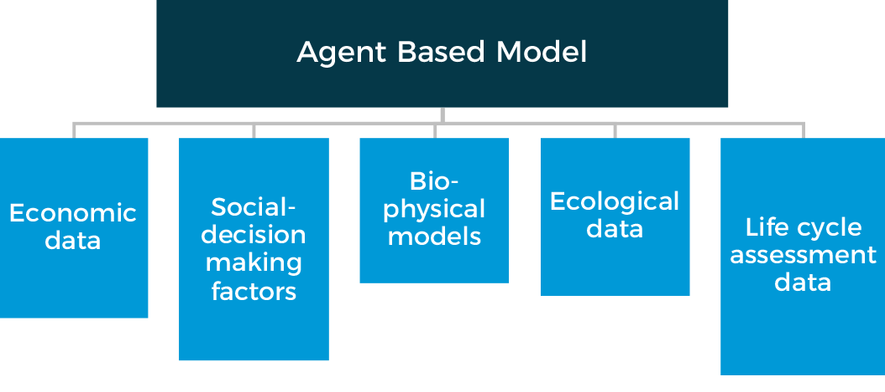
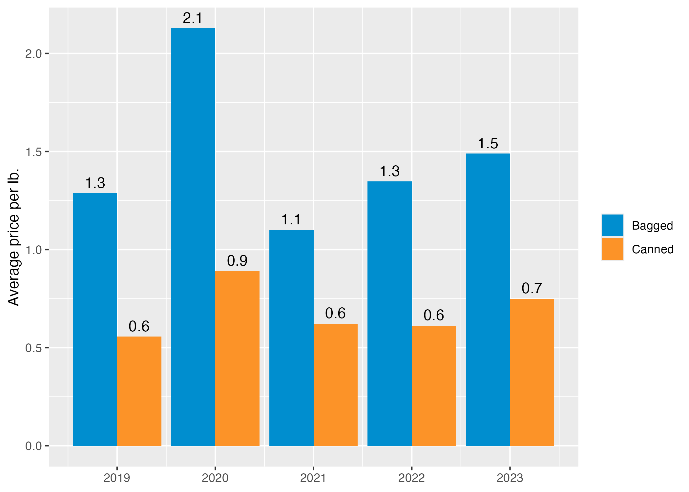

# Research approach {.unnumbered}
Big picture

## Stakeholder engagement
There is growing literature that talks about the importance of engaging stakeholders in all aspects of model design, building, and validation (e.g., [Wentworth et al., 2024](https://www.sciencedirect.com/science/article/pii/S1462901123002940)). Accordingly, this project incorporated commodity specific advisory committees. These advisory groups helped us to select and recruit relevant stakeholders to participate in focus groups and interviews. The focus groups and interviews were used to validate data, understand decision making, and establish model boundaries and decisions.

### Interviews and focus groups {#sec-stakeholder-interviewsfocusgroups}
Add here...

### Causal loop diagrams
As agent-based models are complex, conceptual diagrams such as causal loop diagrams are paramount to understanding and designing the general structure of the model. Using causal loop diagrams in participatory modeling exercises facilitates two important elements of model building. First, developing the causal loop diagrams serves as both a team building exercise and develops a shared understanding of the supply chain of interest. Second, it supports engagement with project stakeholders who may be most knowledgeable about the system being studied but may not have mathematical modeling expertise. Lastly, while it is rarely possible to depict all detail presented in the model in an accessible conceptual diagram, it enables the establishment of the early "building blocks" or general structure of the model including the agents and their connections.

All diagrams can be found in each commodity section. 

## Modeling approach
Drawing on publicly available data as well as input from food and agriculture stakeholders around New York State, this three-year research collaborative adapts an agent-based research model, building upon past agent-based modeling work in Denver, Colorado.

The CFPP model allows for the simulation of complex systems and the emergent behavior that may result from the autonomous actions of system agents with each other and their environment.

This model can simulate a variety of potential changes to a city’s food policy environment and to observe any resulting effects or feedback throughout various stages of the supply chain. To learn more, please visit our GitHub site.

```{r, echo=FALSE}

```

### Model validation
Supply chain and New York City agency stakeholders supported model validation. More details available in the commodity sections. 

#### Bidding
The team, led by Frank Ge from the Dyson School of Applied Economics and Management at Cornell University, advanced a stream of research focused on how vendors may respond to values-based public food procurement bids when cities incorporate attributes such as local sourcing or M/WBE participation into food solicitations. Using a novel game-theoretic (Nash equilibrium) bidding framework, the team is analyzing how vendors adjust bid prices under different procurement environments, with particular attention to how product attributes, vendor competition, and policy design influence bidding behavior. The current paper uses lettuce as a focal example and is calibrated using New York City and New York State procurement data, allowing the team to examine how specific procurement rules, such as NYC’s ability to consider qualifying bids priced up to 10% above the low bid, may shape both bid prices and vendor participation. Early findings suggest that integrating values into bid requests can meaningfully alter prices: for example, local products may carry price premiums that approach the 10% threshold at which NYC can legally consider them, while M/WBE set asides can increase bid prices if they reduce the size of the competitive pool. The work also highlights the importance of vendor participation, showing that additional bidders can substantially reduce prices, although excessive competition may also reduce supplier viability over time.

This bidding research is serving as a key input into the broader City Food Policy agent-based model. While the bidding paper is a stand-alone methodological contribution, its results are also being used to inform and validate how the model represents vendor pricing behavior and procurement responses under alternative policy scenarios. This is especially important because the success of values-based procurement depends not only on supply chain capacity, but also on how vendors strategically respond to changing bid structures and incentives. By grounding these behavioral assumptions in both theory and empirical NYC procurement data, the team is strengthening the model’s ability to simulate more realistic market responses to policy changes. In turn, this improves the project’s broader capacity to estimate whether different procurement strategies are likely to be feasible and achieve New York City’s values-based goals.

#### Agency pricing

##### Price of beans purchased by New York City, 2019-2023

